# QRad
  
  
   
  
                         
   

  ## TABLE OF CONTENTS

  

  [User Story](#userstory) *
  [Features](#features) *
  [Technologies](#technologies) *
  [Prerequisites](*prerequisites) *
  [Installation](#installation) *
  [User Experience](#UserExperience) *
  [Contributions](#contributions) *
  [Questions](#questions) *
  [License](#license)

   

   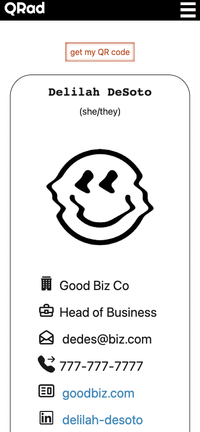 

   
  Live: https://qrad.herokuapp.com/
   
  Repo: https://github.com/hpurring/project-3-group-a
  
   

  ## UserStory

   

As a professional networking with others in my field, I want to offer access to my business card via QR code so that I can trade my information with other individuals and store their contact information in one searchable and secure application.

   

  ## Features

   

  This app allows users to generate a digital business card with a QR code they can share from the profile, and add other business cards to a contact list. 

   

  ## Technologies

  Following technologies were used in the production of this app:

  * HTML5
  * CSS3
  * JavaScript
  * Bootstrap
  * Node.js
  * NPMs
  * Heroku
  * React
  * MongoDB
  * GraphQL

   

  ## Prerequisites

  Make sure you have the following installed on your development machine:

  Git - [Download & Install Git](https://git-scm.com/downloads)
   
  Node.js - [Download & Install Node.js](https://nodejs.org/en/download/)
   
  Visual Studio Code - [Download & Install VS Code](https://code.visualstudio.com/download)
   

  

  ## Installation

  To demo this app in a browser navigate to https://qrad.herokuapp.com/.

  To run this app locally, clone the repo. In a command line interface, navigate to the root of the repo. Run npm install to install all dependencies via the command line:

    npm install

Once sucessfully installed run following command:

    npm run develop

  If it's running correctly the following response should occur in your command line...

   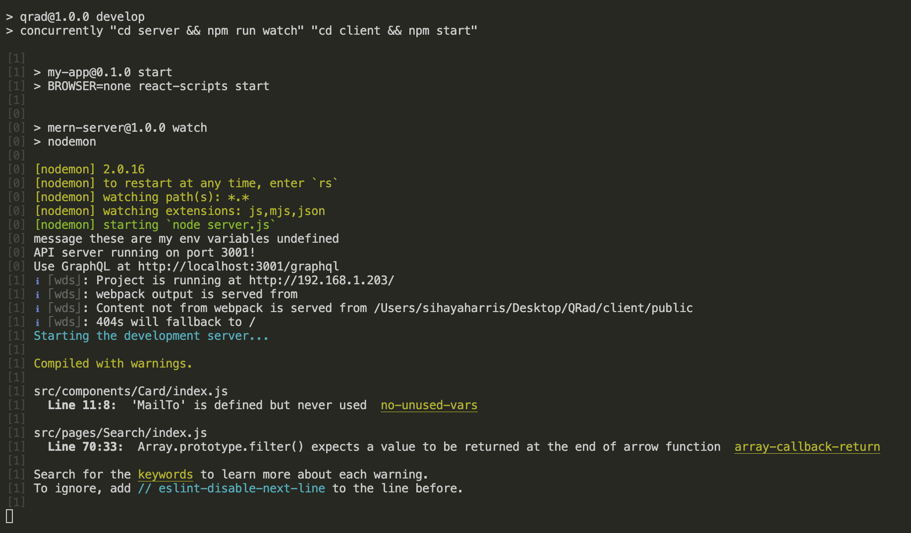 

  You may then navigate to http://localhost:3000/ in your web browser.

   

## UserExperience

From the homepage, select the text link "get started". 
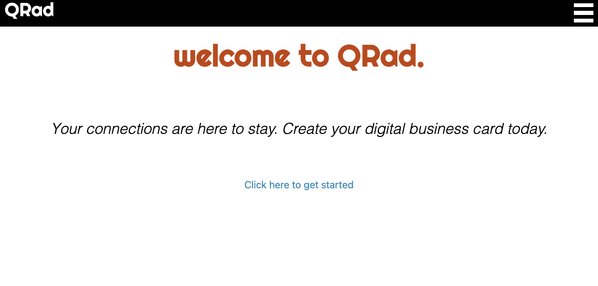 
 
Once at the sign-up page, enter the required data to create a user.
 
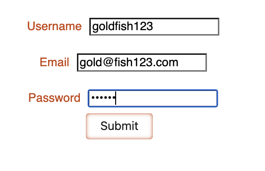
 
Now signed-in, select 'Create my QRad' from the profile page.
 
 
 
Enter all of the necessary form data that will go into the business card. If desired, select a photo to upload.
 
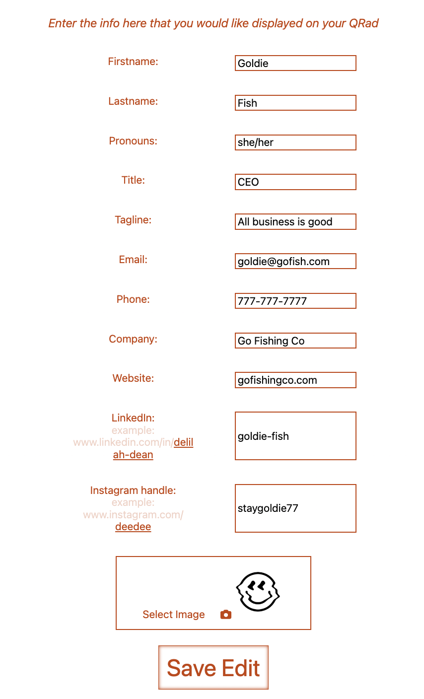 
 
Select Save Edit
 
   
 
After being automatically redirected to the profile page, you can choose to view the business card that's been created.
 
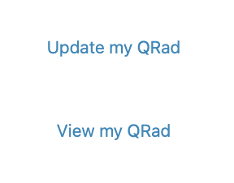
 
On the page with the your business card, you can choose to get the QR code linking to this page.
 
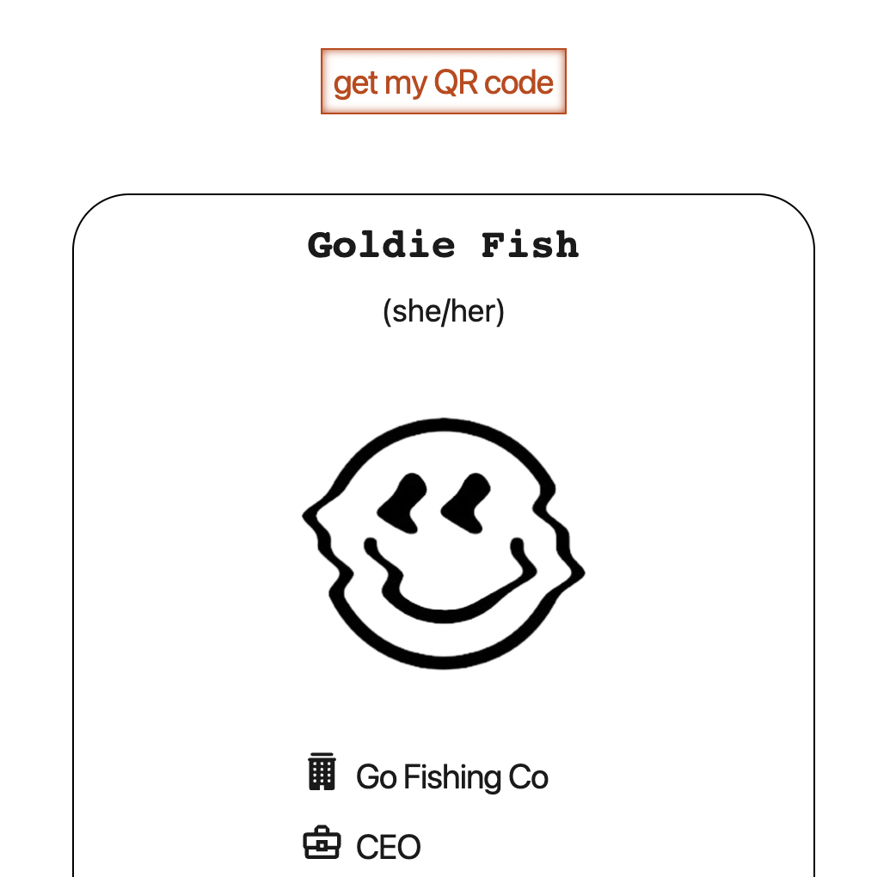 
 
The QR opens up in a modal.
 
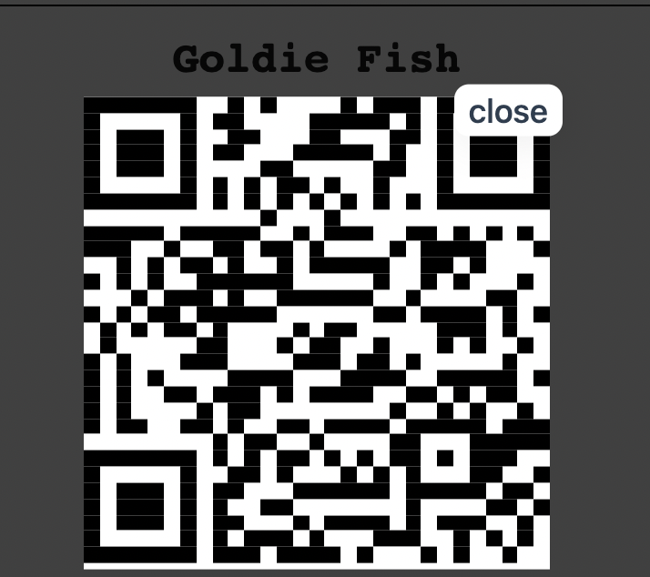 
 
From the sidebar you can navigate to the other sections of the site, such as the contacts page.
 
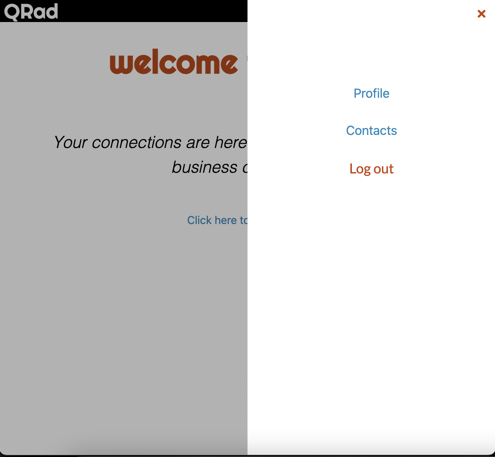 
 
From here you can search by name to find other QR users.
 
 
 
Having found a user you wish to add to your contacts, you may select the add contact button below their card.
 
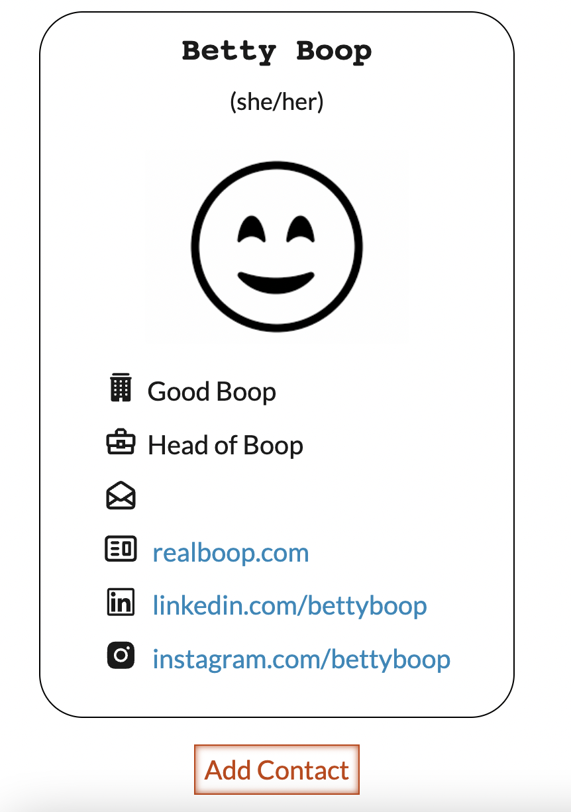
 
The contacts will automatically populate on your contact list.
 
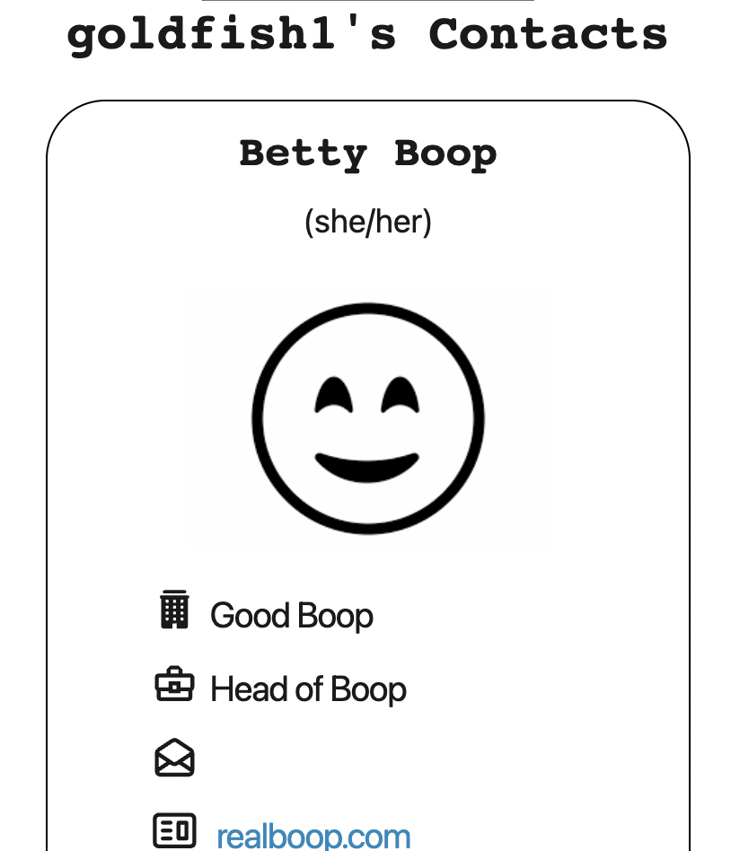 

  

   

  ## Contributions

  Create a pull request to compare to the develop branch.

   

  ## Questions

 

  For any further inquiries, please contact us!
   via gitHub: 
 [(jump89)](https://github.com/jump89)
 [(pcancio)](https://github.com/pcancio)
 [(christian55diaz)](https://github.com/christian55diaz) 
 [(sihayah)](https://github.com/sihayah) 
 [(hpurring)](https://github.com/hpurring) 
 
 or 
 
 email: 
 murcielago203@gmail.com 
 christian55diaz@gmail.com
 pcancio@gmail.com
 sihayaharris@gmail.com
 hilarypurrington@gmail.com
    

   

  

  ## License

  
  
  [click here for more information about ISC license.](https://opensource.org/licenses/ISC)
  

   
   
